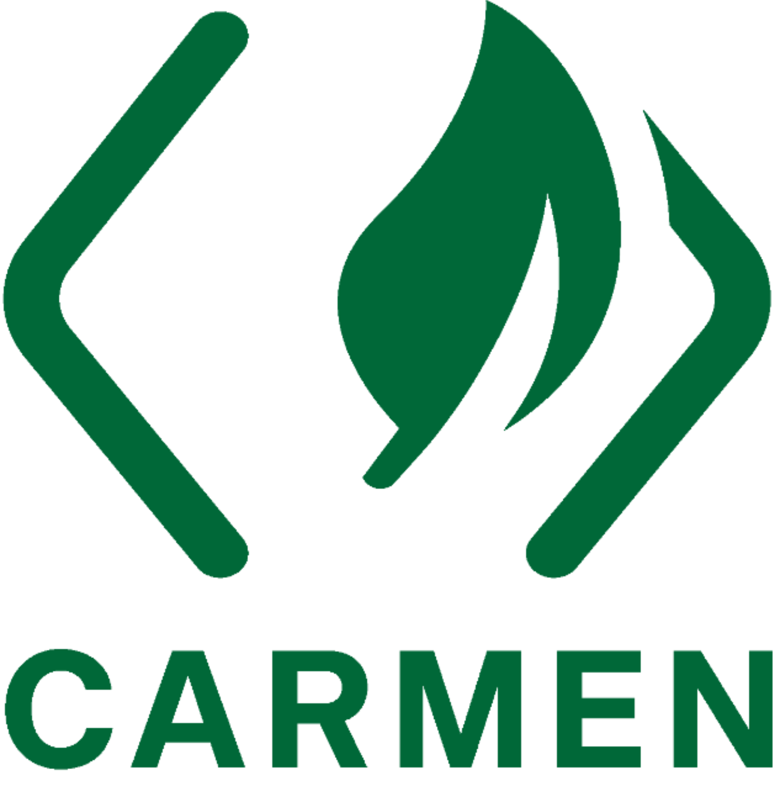

<p align="center">
  
</p>

<p align="center">
  <strong>Carbon Measurement Engine for Cloud Applications</strong>
</p>

---

## Overview

Carmen (Carbon Measurement Engine) is an open-source tool that enables organizations to measure the carbon footprint of their cloud-based software at two critical levels:

- **Infrastructure Level** - Monitor energy consumption and carbon emissions from Virtual Machines, storage, and other cloud services
- **Application Level** - Track the carbon footprint of individual applications and workloads running in your cluster

Carmen integrates seamlessly with industry-standard tools like Kubernetes, Prometheus, and Kube State Metrics, and is built on top of the Impact Framework developed by the Green Software Foundation.

## Motivation

Carmen was created by a group of Amadeus engineers in response to the growing importance of sustainability in the tech industry. As carbon emissions from digital infrastructure continue to rise, organizations need accurate tools to measure and reduce their environmental impact.

Our primary goal is to empower engineering teams to understand the carbon footprint of their cloud applications, enabling them to make informed decisions and take meaningful action toward sustainability. By open-sourcing Carmen, we hope to help companies worldwide join the movement toward greener software.

## Key Features

### Infrastructure Monitoring

The Carmen daemon collects Virtual Machine usage data and processes it through the Impact Framework to generate comprehensive reports on energy consumption and carbon emissions for each VM. Future releases will extend this capability to storage and other cloud services.

### Application Monitoring

Carmen's API can be deployed as a sidecar container within your Kubernetes cluster. By connecting to your local Prometheus instance, Carmen retrieves CPU and memory usage metrics from your pods and computes detailed insights into the energy consumption and carbon footprint of your workloads over any specified time range.

## Getting Started

### Prerequisites

Before installing Carmen, ensure you have the following dependencies:

- Python 3.11 or higher
- pip (Python package manager)
- npm (Node package manager)

### Installation

#### Step 1: Install Impact Framework Dependencies

First, install the Impact Framework and related plugins globally using npm:

```bash
npm install -g "@grnsft/if" "@grnsft/if-plugins" "@grnsft/if-unofficial-plugins"
```

#### Step 2: Install Carmen

We recommend installing Carmen in a virtual environment to keep dependencies isolated.

**For Linux/macOS:**

```bash
python -m venv .venv
source ./.venv/bin/activate
python -m pip install --upgrade pip
python -m pip install amadeus-carmen
```

**For Windows:**

```bash
py -m venv .venv
.\.venv\Scripts\activate
.\.venv\Scripts\python.exe -m pip install --upgrade pip
.\.venv\Scripts\python.exe -m pip install amadeus-carmen
```

### Quick Start

To verify your installation, run the Carmen daemon example:

```bash
cd ./examples-data
carbon-daemon
```

The carbon emissions report will be generated and saved in the `examples-data/output/` directory.

## Documentation

For more detailed information on using Carmen, refer to our comprehensive guides:

- **[Carmen as a Service](./docs/carmen-as-a-service.md)** - Deploy Carmen as an API service in your Kubernetes cluster
- **[Carbon Reporting Daemon](./docs/carmen-daemon.md)** - Generate infrastructure-level carbon reports using the Carmen daemon
- **[Methodology](./docs/methodology.md)** - Understand how Carmen calculates carbon emissions
- **[Comparison with Other Tools](./docs/comparison-with-other-tools.md)** - See how Carmen compares to alternative solutions

## Contributing

We welcome contributions from the community! Whether you're fixing bugs, adding features, improving documentation, or sharing feedback, your input helps make Carmen better for everyone.

Please read our [Contributing Guide](./docs/CONTRIBUTING.md) to get started.

## License

Carmen is released under the [MIT License](./LICENSE).

## Acknowledgments

Carmen is built on the shoulders of the open-source community. We're grateful to:

- **[Impact Framework](https://github.com/Green-Software-Foundation/if)** by the Green Software Foundation - The core framework that powers Carmen's carbon calculations
- **[Cloud Carbon Footprint](https://www.cloudcarbonfootprint.org/)** - For pioneering work in cloud carbon measurement methodologies
- The Kubernetes, Prometheus, and open-source monitoring communities

### Carmen original Team

Carmen was developed and maintained by these outstanding people:

**Carmen creators & project leaders:**
- Robin CASTELLON
- Florent MOREL

**Contributors:**
- Adam Hafiz BIN AHMAD
- Ahmad ELGHOBASHY
- Ahmed ASHOUR
- Amulya LAKKU
- Ashly Maria PRINCE
- Berkay ALKAN
- Cosmin BANICA
- Dariel BEZERRA DE SOUSA
- Eleonore GUEIT
- Kevin COUTELLIER
- Mohamed-Akram MASROUR
- Mouhamad AL MOUNAYAR
- Nicolas GAZELLE DOUKHAN
- Pierre-Luc NOEL
- Pranjal RAJ
- Sami GHARBI
- Selen UYGUN
- Sertay AKPINAR
- Thibaut CHASSIGNET
- Xu HE
- Yannick DEVAUX
---

<p align="center">
  Built with 💚 for a sustainable future
</p>
