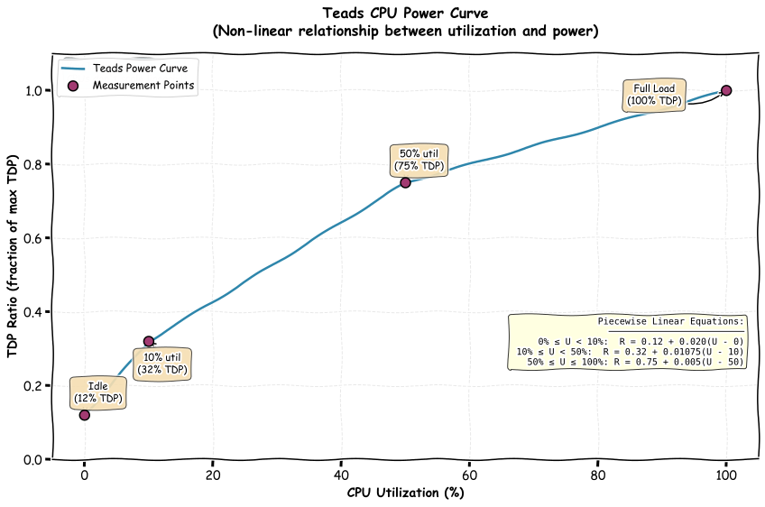

# Methodology

Carmen is built on top of the Impact Framework, an open-source solution developed by the Green Software Foundation. We chose the Impact Framework for several key reasons:   
- First, as highlighted in its documentation, it is designed to support the two essential dimensions of software sustainability metrics: vertical (per-component) analysis and horizontal (over-time) aggregation.
- Second, the framework relies entirely on a manifest-based execution model, ensuring that all calculations are transparent, reproducible, and verifiable, any user can rerun the manifest to validate results and inspect the exact models used.
- Finally, the Impact Framework provides a flexible plugin architecture, enabling us to easily integrate and reuse community-maintained models, while also extending the system with our own. This combination of transparency, extensibility, and methodological rigor makes it a strong foundation for Carmen.

## Infrastructure Pipeline Models
The infrastructure pipeline is used by both the Carbon Daemon and the Run Hardware endpoint of Carmen's API to calculate the Software Carbon Intensity (SCI) for virtual machine workloads. It processes resource usage data, hardware specifications, and sustainability parameters to generate accurate energy and carbon impact metrics for VM infrastructure. This methodology is inspired by the Cloud Carbon Footprint (CCF) approach, with some adaptations.

### Hardware Metadata Retrieval

The pipeline begins with the cloud-metadata component, which performs a CSV lookup using the cloud instance type as the key (e.g., "t3.medium", "n1-standard-4"). This lookup retrieves hardware specifications including the CPU's thermal design power (TDP) measured in Watts, the number of virtual CPUs allocated to the instance, and the amount of memory requested in gigabytes. 

### CPU Power and Energy Calculations

Once we have the CPU's TDP, we need to account for the fact that CPUs don't consume their maximum rated power at all times. The teads-curve component uses linear interpolation to convert the actual CPU utilization percentage into a TDP ratio. 

<figure>
    
    <figcaption>Teads Curve</figcaption>
</figure>

With this ratio, we calculate the actual CPU power consumption. We multiply the TDP ratio by the CPU's thermal design power to get the instantaneous power draw, then divide by 1000 to convert from Watts to kilowatts.

**Equation:**
```
cpu/power (kW) = (tdp-ratio × cpu/thermal-design-power) / 1000
```

Finally, we convert this power into energy consumption over time. Energy is simply power multiplied by time, giving us the total kilowatt-hours consumed by the CPU during the measurement period.

**Equation:**
```
cpu/energy (kWh) = cpu/power (kW) × duration (hours)
```

### Memory Power and Energy Calculations

Memory power consumption is estimated using a coefficient-based approach.The memory coefficient we used is the azure's average taken from the CCF. We multiply the amount of requested memory by this coefficient and convert to kilowatts.

**Equation:**
```
memory/power (kW) = (memory/requested (GB) × memory_coefficient (W/GB)) / 1000
```

Then, similar to the CPU calculation, we determine memory energy consumption. This gives us the total energy consumed by the memory subsystem over the measurement period.

**Equation:**
```
memory/energy (kWh) = memory/power (kW) × duration (hours)
```

### Storage Power and Energy Calculations

Storage follows a similar coefficient-based methodology, with different coefficients for SSD, and HHD disks.

**Equation:**
```
storage/power (kW) = (storage/requested (GB) × storage_coefficient (W/GB)) / 1000
```

The energy calculation follows the standard formula, giving us the total storage energy consumption.

**Equation:**
```
storage/energy (kWh) = storage/power (kW) × duration (hours)
```

### Total Energy and Datacenter Overhead

We aggregate the energy from all three components using a simple summation. This gives us the total energy consumed by the IT equipment itself.

**Equation:**
```
energy (kWh) = cpu/energy + memory/energy + storage/energy
```

However, datacenters require additional energy for cooling systems, power distribution, lighting, and other infrastructure. This overhead is captured by the Power Usage Effectiveness (PUE) metric. A PUE of 1.58, for example, means that for every 1 kWh used by IT equipment, the datacenter consumes 1.185 kWh total. 

**Equation:**
```
energy_adjusted (kWh) = energy (kWh) × PUE
```

### Operational Carbon Emissions

The operational carbon emissions are calculated by converting energy consumption into carbon dioxide equivalent emissions. The grid carbon intensity varies by region and represents how many grams of CO2 equivalent are emitted per kilowatt-hour of electricity consumed. This value depends on the energy mix of the local power grid – regions with more renewable energy have lower intensities, while coal-heavy grids have higher values.

**Equation:**
```
carbon-operational (gCO2e) = energy_adjusted (kWh) × grid_carbon_intensity (gCO2e/kWh)
```

### Embodied Carbon Emissions - Compute

Embodied emissions represent the carbon cost of manufacturing, transporting, and disposing of hardware. The sci-m-cpu component calculates embodied emissions for compute resources using lifecycle analysis. This formula allocates a portion of the server's total embodied emissions to your specific workload based on how many vCPUs you use, for how long, and what fraction of the server's lifetime your usage represents. The total embodied emissions typically include manufacturing emissions, transportation, and end-of-life disposal.

**Equation:**
```
carbon-embodied-cpu (gCO2e) = total_embodied_emissions
                               × (vcpus_allocated / vcpus_total)
                               × (duration / expected_lifespan)
```

### Embodied Carbon Emissions - Storage

Storage also has embodied emissions from manufacturing. The storage embodied coefficient represents the carbon cost per gigabyte of storage device manufacturing. We then prorate this based on how long you used the storage relative to its expected lifespan. For example, if an SSD has an expected lifespan of 4 years and you use 100GB for 1 hour, you're responsible for (1 hour / 35,040 hours) × 100GB × coefficient worth of embodied emissions.

**Equation:**
```
storage-embodied (gCO2e) = storage/requested (GB) 
                           × storage_embodied_coefficient (gCO2e/GB) 
                           × (duration / device_expected_lifespan)
```

### Total Embodied and Final Carbon Footprint

The total embodied emissions combine compute and storage components. 

**Equation:**
```
carbon-embodied (gCO2e) = carbon-embodied-cpu + storage-embodied
```

Finally, the sci component sums operational and embodied emissions to produce the total carbon footprint. 

**Equation:**
```
carbon (gCO2e) = carbon-operational + carbon-embodied
```

This methodology can be observed in practice by examining any manifest file generated by Carmen, where each calculation step is explicitly defined as a plugin with its corresponding inputs, outputs, and parameters.

```yaml
name: infrastructure pipeline
aggregation:
  metrics:
  - energy
  - carbon-operational
  - carbon-embodied
  - cpu/power
  - cpu/energy
  - storage/energy
  - storage-embodied
  type: horizontal
initialize:
  plugins:
    cloud-metadata:
      method: CSVLookup
      path: builtin
      config:
        filepath: /home/malmounayar/carbon-engine/azure_instances.csv
        query:
          instance-class: cloud/instance-type
        output:
        - - cpu-tdp
          - cpu/thermal-design-power
        - - cpu-cores-available
          - vcpus-total
        - - cpu-cores-utilized
          - vcpus-allocated
        - - memory-available
          - memory/requested
    teads-curve:
      method: Interpolation
      path: builtin
      config:
        method: linear
        x:
        - 0
        - 10
        - 50
        - 100
        y:
        - 0.12
        - 0.32
        - 0.75
        - 1.02
        input-parameter: cpu/utilization
        output-parameter: tdp-ratio
    p-cpu:
      method: Multiply
      path: builtin
      config:
        input-parameters:
        - tdp-ratio
        - cpu/thermal-design-power
        output-parameter: = 'cpu/power' / 1000
      parameter-metadata:
        outputs:
          cpu/power:
            unit: kW
            description: CPU power consumption
            aggregation-method:
              time: sum
              component: sum
    e-cpu:
      method: Multiply
      path: builtin
      config:
        input-parameters:
        - cpu/power
        - duration
        output-parameter: = 'cpu/energy' / 3600
      parameter-metadata:
        outputs:
          cpu/energy:
            unit: kWh
            description: CPU energy consumption
            aggregation-method:
              time: sum
              component: sum
    p-mem:
      method: Coefficient
      path: builtin
      config:
        input-parameter: memory/requested
        coefficient: 0.000392
        output-parameter: memory/power
      parameter-metadata:
        outputs:
          memory/power:
            unit: kW
            description: Memory Power consumption
            aggregation-method:
              time: sum
              component: sum
    e-mem:
      method: Multiply
      path: builtin
      config:
        input-parameters:
        - memory/power
        - duration
        output-parameter: = 'memory/energy' / 3600
      parameter-metadata:
        outputs:
          memory/energy:
            unit: kWh
            description: Memory energy consumption
            aggregation-method:
              time: sum
              component: sum
    p-vm-storage:
      method: Coefficient
      path: builtin
      config:
        input-parameter: storage/requested
        coefficient: 9.25e-07
        output-parameter: storage/power
      parameter-metadata:
        outputs:
          storage/power:
            unit: kW
            description: Storage Power consumption
            aggregation-method:
              time: sum
              component: sum
    e-vm-storage:
      method: Multiply
      path: builtin
      config:
        input-parameters:
        - storage/power
        - duration
        output-parameter: = 'storage/energy' / 3600
      parameter-metadata:
        outputs:
          storage/energy:
            unit: kWh
            description: Storage energy consumption
            aggregation-method:
              time: sum
              component: sum
    sci-e:
      method: Sum
      path: builtin
      config:
        input-parameters:
        - cpu/energy
        - memory/energy
        - storage/energy
        output-parameter: energy
      parameter-metadata:
        outputs:
          energy:
            unit: kWh
            description: Energy consumption
            aggregation-method:
              time: sum
              component: sum
    sci-e-pue:
      method: Multiply
      path: builtin
      config:
        input-parameters:
        - energy
        - pue
        output-parameter: energy
      parameter-metadata:
        outputs:
          energy:
            unit: kWh
            description: Energy consumption multiplied by PUE
            aggregation-method:
              time: sum
              component: sum
    sci-m-cpu:
      method: SciM
      path: '@grnsft/if-plugins'
    m-vm-storage:
      method: Multiply
      path: builtin
      config:
        input-parameters:
        - storage/requested
        - storage/embodied-coefficient
        - duration
        output-parameter: = 'storage-embodied' / 126230400
      parameter-metadata:
        outputs:
          storage-embodied:
            unit: gCO2e
            description: Storage embodied emissions
            aggregation-method:
              time: sum
              component: sum
    sci-m:
      method: Sum
      path: builtin
      config:
        input-parameters:
        - carbon-embodied
        - storage-embodied
        output-parameter: carbon-embodied
      parameter-metadata:
        outputs:
          carbon:
            unit: gCO2e
            description: Carbon embodied emissions
            aggregation-method:
              time: sum
              component: sum
    sci-o:
      method: SciO
      path: '@grnsft/if-plugins'
    sci:
      method: Sum
      path: builtin
      config:
        input-parameters:
        - carbon-operational
        - carbon-embodied
        output-parameter: carbon
      parameter-metadata:
        outputs:
          carbon:
            unit: gCO2e
            description: Carbon emissions
            aggregation-method:
              time: sum
              component: sum
        inputs:
          carbon-operational:
            unit: gCO2e
            description: Operational carbon emissions
            aggregation-method:
              time: sum
              component: sum
          carbon-embodied:
            unit: gCO2e
            description: Embodied carbon emissions
            aggregation-method:
              time: sum
              component: sum
  outputs:
  - yaml
tree:
  defaults:
    memory/utilization: 100
    device/emissions-embodied: 1672000
    device/expected-lifespan: 126230400
    storage/embodied-coefficient: 90
    duration: 3600
  pipeline:
    compute:
    - cloud-metadata
    - teads-curve
    - p-cpu
    - e-cpu
    - p-mem
    - e-mem
    - p-vm-storage
    - e-vm-storage
    - sci-e
    - sci-e-pue
    - sci-m-cpu
    - m-vm-storage
    - sci-m
    - sci-o
    - sci
```

## Application Pipeline

The application pipeline is used when calling the Run Engine endpoint of Carmen's API. 
It differs slightly from the infrastructure pipeline in that it focuses on application-level resource usage rather than the full VM footprint. CPU power is calculated based on an interpolated utilization ratio from the Teads curve, and is scaled down according to the number of cores actually reserved for the application.
```yaml
name: app pipeline
aggregation:
  metrics:
  - carbon
  - energy
  - carbon-operational
  - carbon-embodied
  - cpu/energy
  - memory/energy
  - cpu/power
  - resources-reserved
  type: both
initialize:
  plugins:
    teads-curve:
      method: Interpolation
      path: builtin
      config:
        method: linear
        x:
        - 0
        - 10
        - 50
        - 100
        y:
        - 0.12
        - 0.32
        - 0.75
        - 1.02
        input-parameter: cpu/utilization
        output-parameter: tdp-ratio
    p-cores:
      method: Multiply
      path: builtin
      config:
        input-parameters:
        - tdp-ratio
        - cpu/thermal-design-power
        - resources-reserved
        output-parameter: = 'cpu/power' / 1000
      parameter-metadata:
        outputs:
          cpu/power:
            unit: kW
            description: CPU power consumption
            aggregation-method:
              time: sum
              component: sum
        inputs:
          resources-reserved:
            unit: cores
            description: Requested cores
            aggregation-method:
              time: sum
              component: sum
    e-cpu:
      method: Multiply
      path: builtin
      config:
        input-parameters:
        - cpu/power
        - duration
        output-parameter: = 'cpu/energy' / 3600
      parameter-metadata:
        outputs:
          cpu/energy:
            unit: kWh
            description: CPU energy consumption
            aggregation-method:
              time: sum
              component: sum
    p-mem:
      method: Coefficient
      path: builtin
      config:
        input-parameter: memory/requested
        coefficient: 0.000392
        output-parameter: memory/power
      parameter-metadata:
        outputs:
          memory/power:
            unit: kW
            description: Memory Power consumption
            aggregation-method:
              time: sum
              component: sum
    e-mem:
      method: Multiply
      path: builtin
      config:
        input-parameters:
        - memory/power
        - duration
        output-parameter: = 'memory/energy' / 3600
      parameter-metadata:
        outputs:
          memory/energy:
            unit: kWh
            description: Memory energy consumption
            aggregation-method:
              time: sum
              component: sum
    sci-e:
      method: Sum
      path: builtin
      config:
        input-parameters:
        - cpu/energy
        - memory/energy
        - storage/energy
        output-parameter: energy
      parameter-metadata:
        outputs:
          energy:
            unit: kWh
            description: Energy consumption
            aggregation-method:
              time: sum
              component: sum
    sci-e-pue:
      method: Multiply
      path: builtin
      config:
        input-parameters:
        - energy
        - pue
        output-parameter: energy
      parameter-metadata:
        outputs:
          energy:
            unit: kWh
            description: Energy consumption multiplied by PUE
            aggregation-method:
              time: sum
              component: sum
    sci-m-cpu:
      method: SciM
      path: '@grnsft/if-plugins'
    sci-o:
      method: SciO
      path: '@grnsft/if-plugins'
    sci:
      method: Sum
      path: builtin
      config:
        input-parameters:
        - carbon-operational
        - carbon-embodied
        output-parameter: carbon
      parameter-metadata:
        outputs:
          carbon:
            unit: gCO2e
            description: Carbon emissions
            aggregation-method:
              time: sum
              component: sum
        inputs:
          carbon-operational:
            unit: gCO2e
            description: Operational carbon emissions
            aggregation-method:
              time: sum
              component: sum
          carbon-embodied:
            unit: gCO2e
            description: Embodied carbon emissions
            aggregation-method:
              time: sum
              component: sum
  outputs:
  - yaml
tree:
  defaults:
    memory/utilization: 100
    device/emissions-embodied: 1672000
    cpu/thermal-design-power: 3.67
    device/expected-lifespan: 126230400
    storage/energy: 0
    storage-embodied: 0
    duration: 1800
  pipeline:
    compute:
    - teads-curve
    - p-cores
    - e-cpu
    - p-mem
    - e-mem
    - sci-e
    - sci-e-pue
    - sci-m-cpu
    - sci-o
    - sci
```
